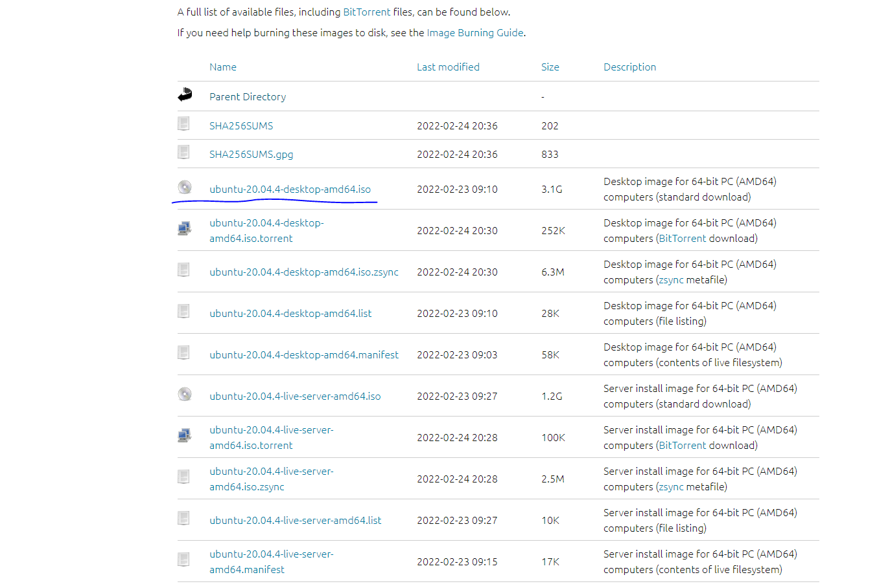
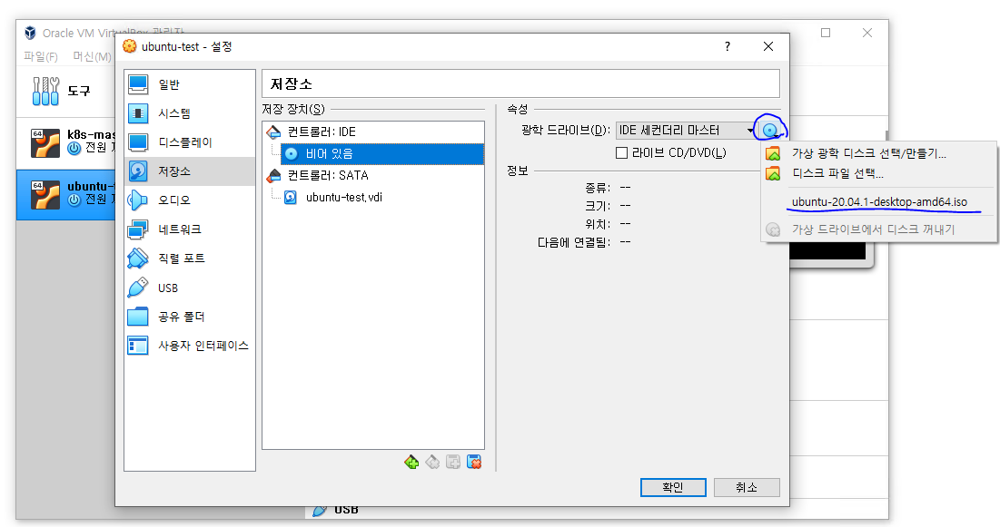
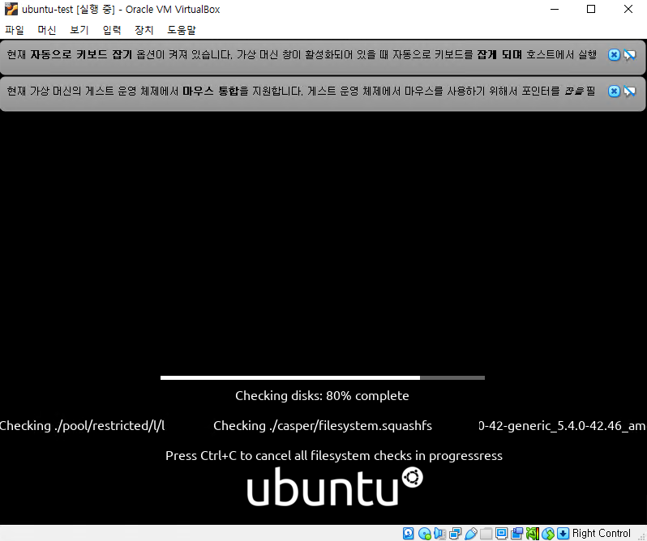
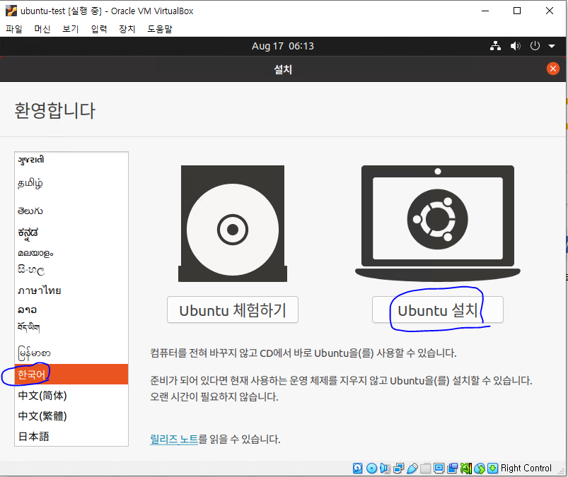
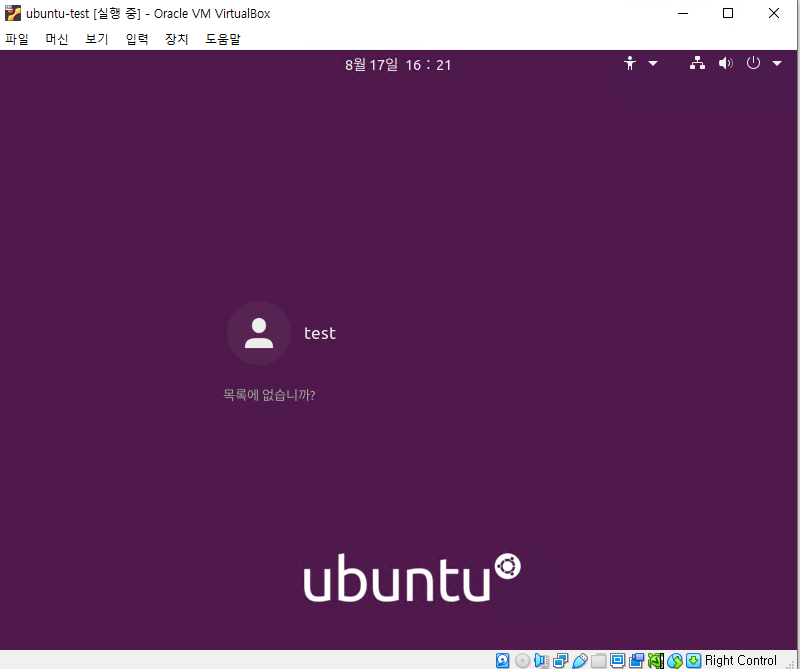

# 제작한 Virtual Box에 Ubuntu를 설치해 봅시다.

- 가장 먼저 [Ubuntu 홈페이지](https://releases.ubuntu.com/20.04/?_ga=2.53400554.399419515.1660715428-486911548.1660715428)에 접속
- 이후 ubuntu-20.04.4-desktop-amd64.iso를 다운받습니다. (22.04 LTS 버전이 아닙니다.)
  

# ubuntu 설치 준비

- 사전에 설치해두었던 Virtual Box를 선택하고 설정을 클릭합니다.
- 저장소로 들어가 컨트롤러:IDE에서 다운받은 Iso 파일을 선택합니다.
  

- 이후 Virtual Box를 실행시켜 우분투 설치를 시작합니다.
  

# ubuntu 설치 진행

- 이제 본격적으로 설치를 진행해봅시다.
- 가장 먼저 뜨는 화면에서 진행할 언어를 한국어로 변경하고 우분투 설치를 클릭합니다.
  

- 계속하기를 계속 눌러주고 우분투에서 사용할 이름과 Password를 입력해줍니다.
- 설치가 진행되나 저의 경험상 약 20~30분 가량 소요되었던 것으로 기억합니다.
- 설치가 완료된 후 Virtual box를 재시작해주면 아래와 같이 설치가 완료됩니다.

  
