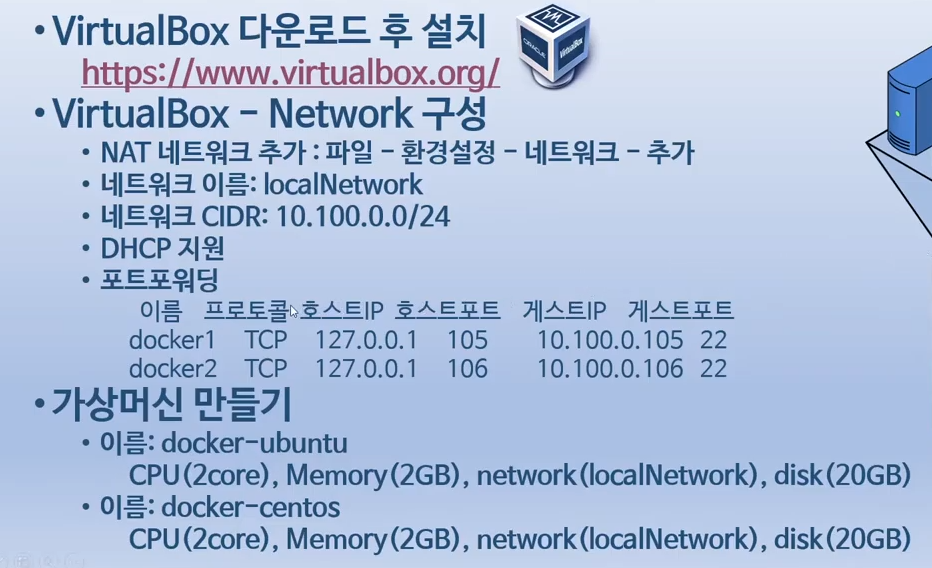
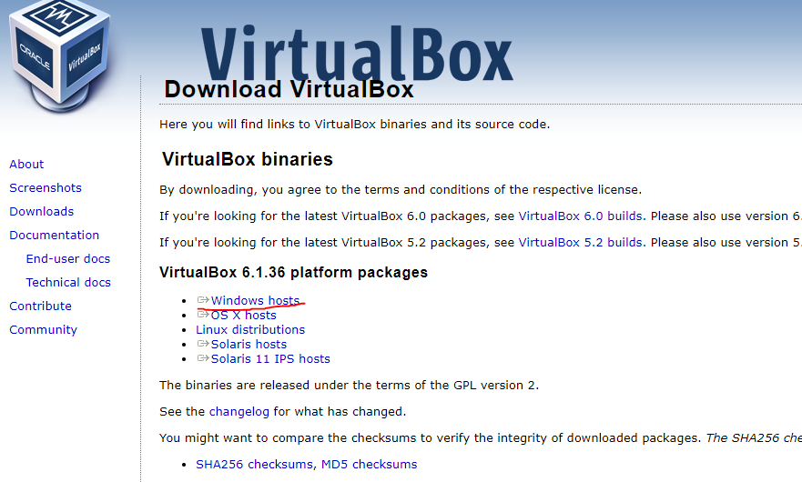
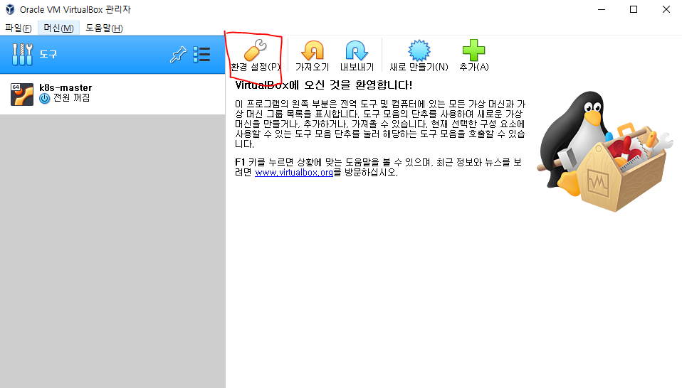
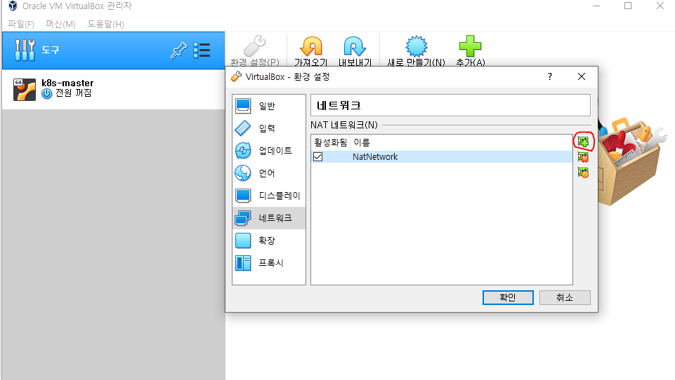
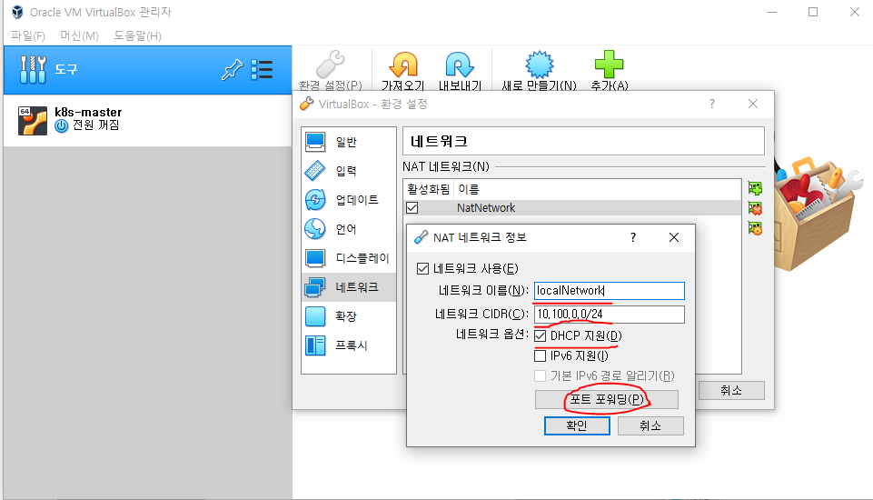
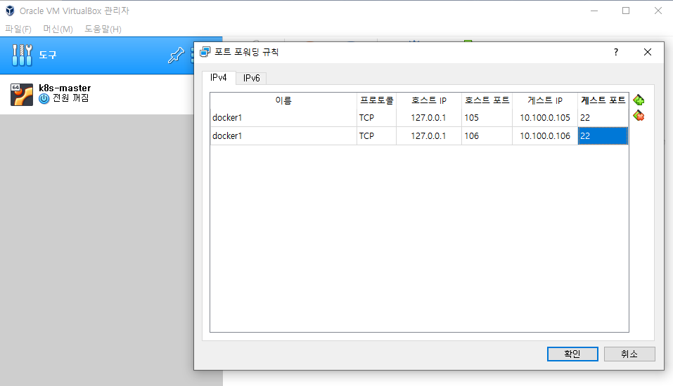
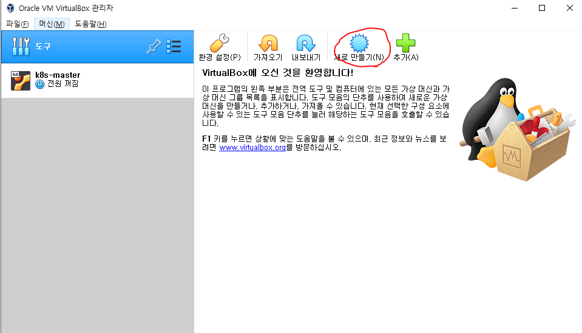
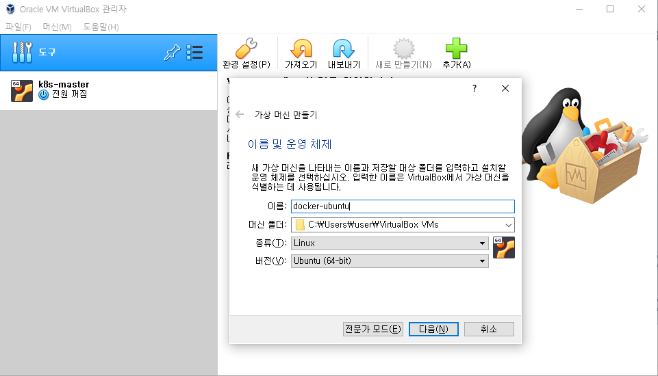

# Virtual Box 설정을 진행해봅시다!

- 아래와 같이  Virtual Box의 네트워크 설정을 진행해봅시다.
  

# Virtual Box 설치

- Oracle VM VirtualBox를 설치해보겠습니다.
- 설치의 경우, [2-1. 도커 설치하기 Virtualbox 설치 / VM 생성](https://www.youtube.com/watch?v=PqgWp7rbqws)를 참고하여 진행하였습니다.
- 가장 먼저 VirtualBOX를 [다운로드](https://www.virtualbox.org/)를 진행합니다.
- 기본 셋팅을 변경하지 않고 설치를 진행합니다.

  

  

# Virtual Box 네트워크 설정

- 환경설정에서 새로운 네트워크를 추가합니다.
<left></left> <right></right> 

- 위 이미지와 동일하게 네트워크 이름, 네트워크 CIDR,  포트포워딩을 진행해봅시다.
<left></left> <right></right> 

# Virtual Box 만들기

- 새로운 virtual Box를 제작해봅시다.
<left></left> <right></right> 

- 원하는 CPU의 수, Memory 크기, 네트워크, 용량을 설정한후 제작하면 기본 Virtual Box 생성 완료!
